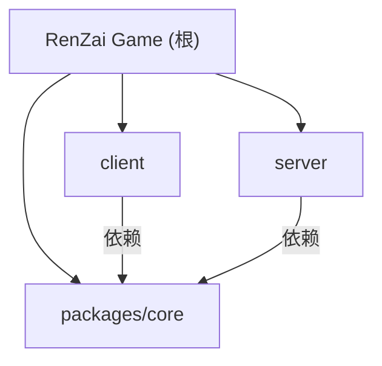

# RenZai Game (人在江湖) - 项目指南

## 项目愿景

一款水墨风武侠 MUD 游戏，采用 React Native 客户端 + NestJS 后端，通过 WebSocket 实现实时通信。项目名称"人在江湖"，玩家以文本交互形式体验武侠世界。

## 架构总览

```
pnpm monorepo (workspace)
├── client/          # React Native 移动端（iOS / Android）
├── server/          # NestJS 后端服务
└── packages/core/   # 前后端共享类型与消息工厂
```

- **通信协议**: WebSocket（原生 `ws` 库，非 Socket.IO）
- **数据库**: MySQL + TypeORM
- **包管理器**: pnpm (workspace)
- **语言**: TypeScript（全栈）

### 模块结构图



### 通信流程

```
Client (React Native)
  └─ WebSocketService.send()
       └─ MessageFactory.serialize() ──WebSocket──> Server (NestJS)
                                                      └─ GameGateway.handleMessage()
                                                           └─ MessageFactory.deserialize()
                                                                └─ Handler (auth/ping/...)
                                                                     └─ MessageFactory.create() + serialize() ──> Client
```

## 模块索引

| 模块 | 路径 | 语言 | 职责 |
|------|------|------|------|
| Client | `client/` | TypeScript (React Native) | 水墨风 UI、WebSocket 通信、路由导航 |
| Server | `server/` | TypeScript (NestJS) | WebSocket Gateway、账号管理、数据库 |
| Core | `packages/core/` | TypeScript | 共享消息类型、MessageFactory、序列化/反序列化 |

## 开发命令

### 安装依赖

```bash
# 根目录安装所有 workspace 依赖
pnpm install

# 构建 core 包（server 和 client 依赖 core 的编译产物）
cd packages/core && pnpm build
```

### 启动开发服务

```bash
# 后端（NestJS，端口 4000，支持热重载）
pnpm server:dev          # 或 cd server && pnpm start:dev

# 前端 Metro bundler
pnpm client:start        # 或 cd client && pnpm start

# iOS 模拟器
pnpm client:ios          # 或 cd client && pnpm ios

# Android 模拟器
pnpm client:android      # 或 cd client && pnpm android
```

### 测试

```bash
cd server && pnpm test       # 单元测试
cd server && pnpm test:e2e   # 端到端测试
cd client && pnpm test       # 客户端测试
```

### 代码格式化

```bash
pnpm format              # Prettier 全量格式化
pnpm format:check        # 检查格式
pnpm lint                # ESLint（server + client）
```

## 热重载规则（重要）

前端（Metro bundler）和后端（`nest start --watch`）均支持热重载。代码修改后**不需要**重启服务。

**仅在以下情况需要重启:**

1. **安装了新的 npm 包**（`pnpm install` / `pnpm add` 之后）
2. **修改了配置文件**（`nest-cli.json`、`metro.config.js`、`tsconfig.json`、`.env` 等）
3. **进程崩溃**

**不需要重启的情况:**

- 修改 `.ts` / `.tsx` 源代码文件
- 修改样式
- 添加/删除组件
- 修改业务逻辑

## 环境变量

服务端需要 `.env` 文件（位于 `server/.env`），必需字段:

```
NODE_ENV=development
PORT=4000
DB_HOST=localhost
DB_PORT=3306
DB_USERNAME=root
DB_PASSWORD=xxx
DB_DATABASE=renzai_game
```

## 项目结构详情

### Client (`client/`)

```
client/
├── App.tsx                          # 根组件，WebSocket 连接 + 路由
├── src/
│   ├── screens/
│   │   ├── LoginScreen.tsx          # 登录页（水墨风）
│   │   ├── RegisterScreen.tsx       # 注册页
│   │   ├── CreateCharacterScreen.tsx # 创建角色页（占位）
│   │   └── GameHomeScreen.tsx       # 游戏主页（占位）
│   ├── services/
│   │   └── WebSocketService.ts      # WebSocket 服务（单例，心跳+重连）
│   └── components/
│       ├── GameAlert.tsx            # 水墨风弹窗
│       ├── GameToast.tsx            # 水墨风 Toast
│       ├── UIProvider.tsx           # UI 上下文（Alert/Toast 全局管理）
│       └── index.ts                 # 组件导出
├── ios/                             # iOS 原生工程
├── android/                         # Android 原生工程
└── metro.config.js                  # Metro 配置（monorepo watchFolders）
```

- **导航**: `@react-navigation/native-stack`，路由: Login -> Register / CreateCharacter / GameHome
- **WebSocket**: App 启动时连接 `ws://localhost:4000`，生命周期跟随进程
- **UI 风格**: 水墨风（ink-wash），配色 `#F5F0E8`/`#8B7A5A`/`#3A3530`，字体 Noto Serif SC

### Server (`server/`)

```
server/
├── src/
│   ├── main.ts                      # 入口，WsAdapter 配置
│   ├── app.module.ts                # 根模块
│   ├── config/
│   │   ├── database.config.ts       # TypeORM MySQL 配置
│   │   └── env.validation.ts        # 环境变量验证（class-validator）
│   ├── health/
│   │   ├── health.controller.ts     # GET /health
│   │   ├── health.service.ts
│   │   └── health.module.ts
│   ├── account/
│   │   ├── account.entity.ts        # Account 表（UUID, username, password, phone）
│   │   ├── account.service.ts       # 注册/登录业务逻辑（bcrypt）
│   │   └── account.module.ts
│   └── websocket/
│       ├── websocket.gateway.ts     # GameGateway（连接管理、消息路由）
│       ├── websocket.module.ts
│       ├── types/
│       │   └── session.ts           # Session 接口（内存 Map 存储）
│       └── handlers/
│           ├── auth.handler.ts      # 登录/注册处理器
│           └── ping.handler.ts      # 心跳处理器
├── nest-cli.json
├── tsconfig.json
└── .env                             # 环境变量（不入库）
```

- **WebSocket 适配器**: `@nestjs/platform-ws`（原生 ws，非 Socket.IO）
- **消息路由**: `@SubscribeMessage('message')` 接收，内部 switch 分发到各 Handler
- **Session**: 内存 Map<socketId, Session>，连接时创建，断开时销毁
- **数据库**: MySQL，开发环境 `synchronize: true`，字符集 `utf8mb4`

### Core (`packages/core/`)

```
packages/core/
├── src/
│   ├── index.ts                     # 导出入口
│   ├── types/
│   │   ├── base.ts                  # BaseMessage / ClientMessage / ServerMessage
│   │   ├── messages/
│   │   │   ├── auth.ts              # Login/Register 消息类型
│   │   │   ├── ping.ts              # Ping 消息
│   │   │   └── ui.ts               # Toast/Alert 消息
│   │   └── index.ts
│   └── factory/
│       ├── MessageFactory.ts        # 工厂核心（create/validate/serialize/deserialize）
│       ├── handlers/                # 各消息类型的处理器（@MessageHandler 装饰器注册）
│       │   ├── login.ts
│       │   ├── loginSuccess.ts
│       │   ├── loginFailed.ts
│       │   ├── register.ts
│       │   ├── registerSuccess.ts
│       │   ├── registerFailed.ts
│       │   ├── ping.ts
│       │   ├── toast.ts
│       │   └── alert.ts
│       └── index.ts
└── package.json
```

- **MessageFactory**: 使用装饰器 `@MessageHandler(type)` 自动注册处理器
- **消息格式**: `{ type: string, data: T, timestamp: number }`
- **修改 core 后**: 需要 `cd packages/core && pnpm build` 重新编译

## 编码规范

- **注释语言**: 中文
- **变量命名**: 英文（PascalCase 组件/类，camelCase 函数/变量）
- **数据库**: snake_case 字段名，COMMENT 中文说明
- **消息类型**: camelCase（如 `loginSuccess`、`registerFailed`）
- **文件头部**: 每个文件顶部都有功能描述注释
- **代码格式**: Prettier + ESLint

## 测试策略

- Server: Jest（`pnpm test` 单元测试，`pnpm test:e2e` 端到端）
- Client: Jest + React Test Renderer
- 当前测试覆盖: 基础框架已搭建，覆盖率待提升

## 重要注意事项

1. **core 包修改后必须重新构建**: `cd packages/core && pnpm build`，否则 server/client 引用的是旧的编译产物
2. **WebSocket 端口**: 服务端统一端口 4000（HTTP + WS 共用）
3. **数据库**: 开发环境使用 `synchronize: true` 自动同步表结构，生产环境**必须关闭**
4. **密码加密**: bcrypt（rounds=10），不可逆
5. **Session 存储**: 当前使用内存 Map，服务重启后所有连接失效

## AI 使用指引

- 修改 `packages/core/` 下的类型或工厂后，提醒用户需要 `pnpm build`
- 添加新消息类型时，需要在 `packages/core/src/factory/handlers/` 添加处理器并用 `@MessageHandler` 装饰器注册
- 添加新的 WebSocket 消息处理时，需要在 `websocket.gateway.ts` 的 switch 中添加路由
- 前端新页面需要在 `client/App.tsx` 的 Stack.Navigator 中注册路由
- 数据库新实体需要在对应模块中 `TypeOrmModule.forFeature([Entity])` 注册

## 变更记录 (Changelog)

- **2026-02-02**: 初始化项目 CLAUDE.md，记录项目架构、开发指南、编码规范
